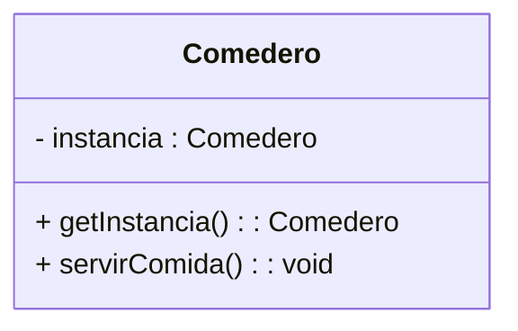
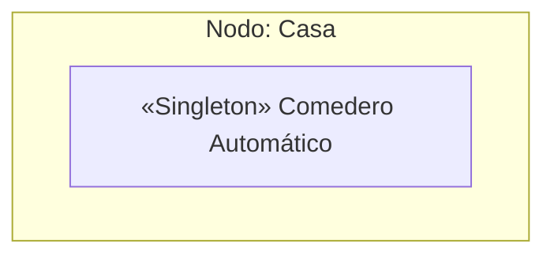
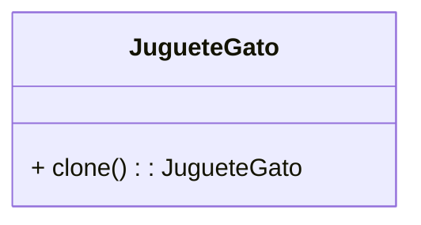
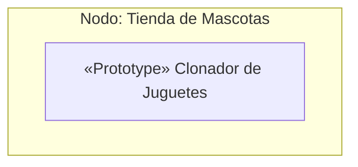
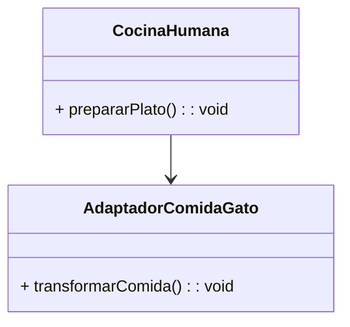
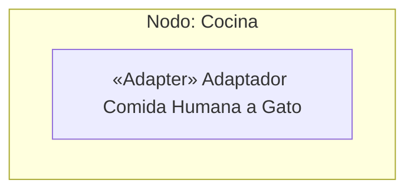
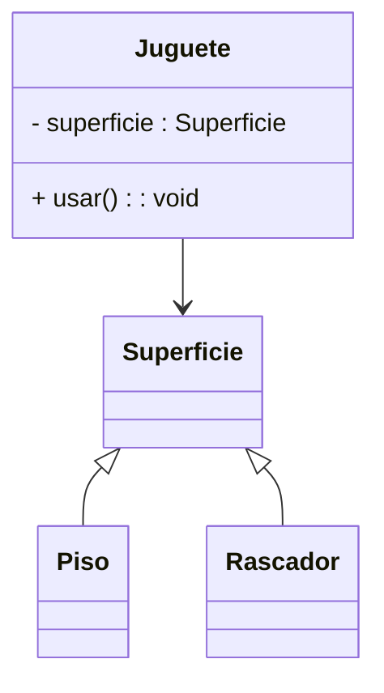
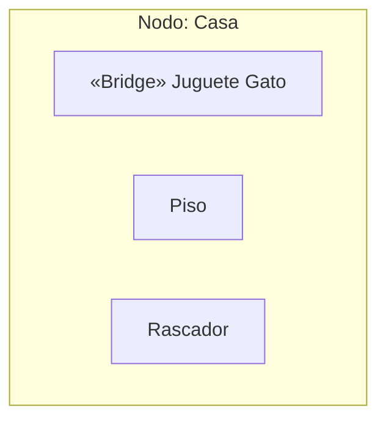

# Diseño de Diagramas de Implementación con Patrones de Diseño

Hoy vamos a dar un paso importante en el diseño de software: llevaremos nuestros patrones de diseño al mundo real, representándolos en diagramas de implementación UML.
Veremos cómo nuestros diseños no solo son teóricos, sino que se reflejan en arquitecturas físicas de sistemas escalables y reales.

## Objetivos de la Clase

✅ Comprender qué es un Diagrama de Implementación UML.  
✅ Reconocer cómo los patrones de diseño impactan en el diseño físico.  
✅ Aplicar patrones en un caso real y representarlos en un diagrama de implementación profesional.  

---

## ¿Qué es un Diagrama de Implementación UML?

Un diagrama de implementación representa la **arquitectura física** del sistema.  
Muestra **nodos**, **componentes**, artefactos y las **conexiones** entre ellos.  
Refleja **cómo se despliega el software en el mundo real**: en qué servidores, dispositivos o contenedores se ejecutan nuestros módulos.

### Elementos clave:
- 🔷 **Nodo**: unidad física (servidores, dispositivos, nube, etc.).
- 🧩 **Componente**: unidad lógica de software desplegable (servicio, API, módulo).

---

## 🌐 Ejemplo de Transición con Patrones

### 🔁 Singleton

#### Diagrama de Clases

#### Diagrama de Implementación

#### Explicación
Aquí tenemos el patrón **Singleton** representado primero como diagrama de clase, donde ya conocemos que el `Comedero` tiene una **única instancia controlada por el método `getInstancia()`**.  
Eso representa el nivel lógico.

Cuando llevamos esto al **mundo físico**, representamos ese `Comedero` como un **componente dentro del nodo físico 'Casa'**.  
Así damos el salto del diseño lógico al **despliegue real del sistema**.

---

### 🔁 Prototype

#### Diagrama de Clases

#### Diagrama de Implementación

#### Explicación
En el patrón **Prototype**, ya conocemos la clase `JugueteGato` con su método `clone()` que permite duplicar el juguete.  
Eso es el nivel lógico, en programación.

Cuando vamos al **diagrama de implementación**, representamos ese proceso como un **componente llamado 'Clonador de Juguetes'**, desplegado dentro del nodo **'Tienda de Mascotas'**.  
Así reflejamos que la clonación es un módulo independiente que podría estar desplegado en un servidor o sistema físico.

---

### 🔁 Adapter

#### Diagrama de Clases

#### Diagrama de Implementación

#### Explicación
En el patrón **Adapter**, ya conocíamos el caso donde `CocinaHumana` necesita adaptar comida para gatos usando un `AdaptadorComidaGato`.  
Eso es el nivel de clases.

Pero cuando pasamos al **diagrama de implementación UML**, representamos el adaptador como un **componente desplegado en la 'Cocina'**, donde se encarga de recibir los platos humanos y transformarlos en comida apta para el gato.  
Así visualizamos cómo ese adaptador vive en un nodo físico y cumple su rol como un puente entre sistemas incompatibles.

---

### 🔁 Bridge

#### Diagrama de Clases

#### Diagrama de Implementación

#### Explicación
En el patrón **Bridge**, vimos que el `Juguete` puede operar sobre distintas superficies (`Piso`, `Rascador`), separando la abstracción de la implementación concreta.  
Eso es el nivel lógico en clases.

Pero cuando llevamos esto al **diagrama de implementación**, visualizamos el `Juguete Gato` como un **componente dentro del nodo 'Casa'**, interactuando con otros componentes (`Piso`, `Rascador`).  
Así reflejamos que el juguete puede operar en distintas superficies físicas, y cada una está implementada como un módulo separado que puede evolucionar independientemente.

## 🏥 Caso Real: Sistema de Bodega de Insumos Médicos

Este caso representa un sistema corporativo de alta exigencia, con trazabilidad total, control de insumos por código de barras, generación de alertas inteligentes y auditoría detallada.  
Además, incluye **integración con el ERP hospitalario** y **gestión de accesos por roles**, posicionándose como un sistema realista alineado a normativas como las exigidas por MINSAL.

---

### 📌 Diagrama de Casos de Uso

# 🏥 Sistema de Bodega de Insumos Médicos

Este repositorio presenta el diseño profesional de un sistema de bodega de insumos médicos, modelado con patrones de diseño reales y diagramas UML completos, ideal como referencia para proyectos corporativos o académicos de alta exigencia.

## 📋 Descripción General

El sistema abarca la trazabilidad de insumos médicos, el control de stock por código de barras, generación de alertas inteligentes y auditoría detallada. Incluye, además, integración con sistemas ERP hospitalarios y gestión de accesos por roles, cumpliendo normativas como las exigidas por MINSAL.

---
## 🗂️ Diagrama de Clases — Sistema de Bodega con Patrones Aplicados

### Patrones de Creación
- **Singleton:** `ConfiguracionSistema`
- **Factory Method:** `FabricaMovimiento`
- **Prototype:** `PlantillaMovimiento`

### 🏗️ Patrones Estructurales
- **Adapter:** `AdaptadorERP`
- **Bridge:** `InterfazUsuario`
- **Decorator:** `NotificacionUrgente`
- **Composite:** `GrupoInsumo`
- **Facade:** `SistemaFacade`

### ⚙️ Patrones de Comportamiento
- **Observer:** `ObservadorAlerta`
- **Mediator:** `CoordinadorEventos`
- **Command:** `MovimientoInsumo`

---

Este diagrama no solo tiene muchas clases, sino que está lleno de **patrones de diseño** que resuelven distintos tipos de problemas reales:

- **Patrones de creación**: controlan cómo se crean los objetos, permitiendo flexibilidad y control.
- **Patrones estructurales**: organizan las clases en estructuras flexibles y escalables, permitiendo independencia entre módulos y mejorando la mantenibilidad.
- **Patrones de comportamiento**: definen cómo las clases interactúan y se comunican de forma desacoplada, eficiente y controlada.

🔹 Así se logra una **arquitectura profesional y corporativa**:  
Cada clase tiene un propósito claro, los patrones están aplicados en el lugar correcto, y las relaciones son limpias, potentes y fáciles de mantener.

---

### 📷 Diagrama de Clases

## 🚀 De la Visión Funcional a la Arquitectura Física — Transición Completa Profesional

Esta es la transición completa que debe hacer un arquitecto senior:

- Desde la **visión funcional**, donde entendemos **qué hace el sistema y quién lo usa**.
- Pasando al **diseño lógico** con un **diagrama de clases robusto**, aplicando más de 10 patrones de diseño.
- Hasta llegar al **diagrama de implementación UML**, donde representamos cómo estos módulos se despliegan en nodos reales, conectando servicios, integraciones, bases de datos y dispositivos.

Este enfoque permite:
- ✔️ Diseñar **sistemas escalables, mantenibles y preparados para el crecimiento**.
- ✔️ Comunicar claramente la arquitectura a desarrolladores, operaciones y stakeholders.
- ✔️ Entender cómo los patrones impactan tanto en el código como en la infraestructura.

---

## 🏗️ Diagrama de Implementación UML — Despliegue Físico con Patrones Aplicados

# 🏥 Sistema Tunomático — Modelado Arquitectónico Profesional

## Descripción General

El presente trabajo consiste en el modelado arquitectónico completo de un **Sistema de Gestión de Turnos Digitales (Tunomático)**, siguiendo buenas prácticas de diseño orientado a objetos y aplicando patrones de diseño reconocidos.  
El objetivo es demostrar la transición completa desde la visión funcional (casos de uso) hasta la arquitectura física (implementación), reflejando tanto el diseño lógico (diagrama de clases con patrones aplicados) como la distribución en nodos y componentes reales (diagrama de implementación UML).

---

## 📝 Entregables Obligatorios

1. **Diagrama de Casos de Uso UML**
   - Debe incluir actores, casos de uso principales y secundarios.
   - Aplicar obligatoriamente relaciones `<<include>>` y `<<extend>>` donde corresponda.
   - Reflejar claridad, realismo y detalle.

2. **Diagrama de Clases UML**
   - Clases con atributos, métodos, visibilidad y cardinalidad correcta.
   - Aplicación obligatoria de al menos 3 de los 4 patrones vistos (**Singleton, Prototype, Adapter, Bridge**).
   - Uso obligatorio de estereotipos (`<<Singleton>>`, etc.).
   - No debe haber ninguna clase vacía o sin relaciones claras.

3. **Diagrama de Implementación UML**
   - Nodos físicos, componentes y conexiones bien representadas.
   - Reflejar los patrones aplicados en la arquitectura física.
   - Incluir notas UML explicando decisiones arquitectónicas y patrones usados.

4. **README.md completo en el repositorio**
   - Debe seguir **exactamente** el formato, estructura y nivel de redacción profesional del ejemplo de Insumos Médicos.
   - Incluir:  
     - Descripción general del sistema.
     - Imagen del caso de uso + descripción y justificación de relaciones.
     - Imagen del diagrama de clases + justificación profunda de patrones.
     - Imagen del diagrama de implementación + decisiones técnicas.
     - Reflexiones finales del modelado.

   - **No se aceptarán README básicos, incompletos o sin redacción técnica formal.**

---

## 📦 Condiciones de Entrega

- La entrega es **exclusivamente mediante un repositorio público en GitHub**.
- La estructura del repositorio debe ser exactamente la misma que el ejemplo de Insumos Médicos:
  - `README.md` completo.
  - Carpeta `imagenes/` (o similar) con los diagramas exportados.
- No se aceptan entregas por correo, archivos comprimidos ni repositorios privados.
- El enlace al repositorio debe ser enviado por correo, con **redacción profesional**.
- No se aceptarán correos tardíos alegando olvido de envío, aun si GitHub muestra la fecha correcta.
- Todo trabajo enviado fuera del procedimiento o después del viernes recibe **nota mínima automática (1.0)**.

---

## 📊 Rúbrica de Evaluación

| Criterio | Puntos |
| --- | --- |
| Caso de uso completo, claro, con relaciones formales (`<<include>>`, `<<extend>>`) | 20 pts |
| Diagrama de clases completo, con atributos, métodos, visibilidad, relaciones y patrones aplicados correctamente (`<<Singleton>>`, `<<Prototype>>`, etc.) | 30 pts |
| Diagrama de implementación profesional, reflejando componentes, nodos, conexiones y patrones aplicados | 30 pts |
| README completo, con redacción profesional, siguiendo exactamente el estándar entregado (Ejemplo Insumos Médicos) | 20 pts |
| **Total** | **100 pts** |

---

## 🎁 Bonificaciones

**Condición de envío anticipado**  | **Bonificación máxima**
--- | ---
Trabajo entregado antes del fin del viernes | +1.0
Trabajo enviado antes del lunes siguiente   | +0.7
Trabajo enviado antes del martes siguiente  | +0.5
Desde el miércoles en adelante              | Sin bonificación

### Bonificaciones: Aplicación proporcional según nota

- Las bonificaciones se otorgan **únicamente** si el trabajo es entregado correctamente y cumple **todos los requisitos exigidos** (estructura, formato, redacción, repositorio en GitHub, etc.).
- **No** son fijas, sino que se calculan proporcionalmente a la nota obtenida.
- Ejemplo:  
  Si el trabajo se entrega antes del bloque de clase (**bonificación base +1.0**), pero la nota final es 4.0, la bonificación será **4.0 x 0.14 = 0.56** (no el punto completo).
- Esto se aplica para todas las bonificaciones, según la nota final obtenida.

---

## 📌 Importante

- **Cualquier entrega que no cumpla exactamente con la estructura, documentación, redacción y presentación profesional será penalizada en la nota.**
- La calidad esperada es **idéntica** al ejemplo de Insumos Médicos, sin excepciones.

---

## 🏁 Reflexión Final

El trabajo espera que desarrolles una visión profesional del modelado arquitectónico, comprendas la importancia de la trazabilidad entre visión funcional, lógica y física, y te acostumbres a estándares de documentación de alto nivel.  
El objetivo no es solo cumplir, sino **modelar como lo haría un arquitecto senior en la industria real**.

---

[clase 8.pdf](https://github.com/user-attachments/files/20265548/clase.8.pdf)

[Readme Ejemplo](https://github.com/lonkonao/PatronesDeDiseno/tree/main/ejemplo/2)
