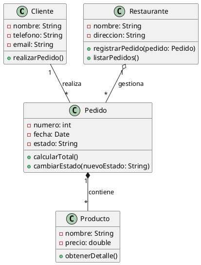
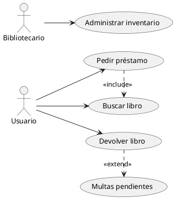
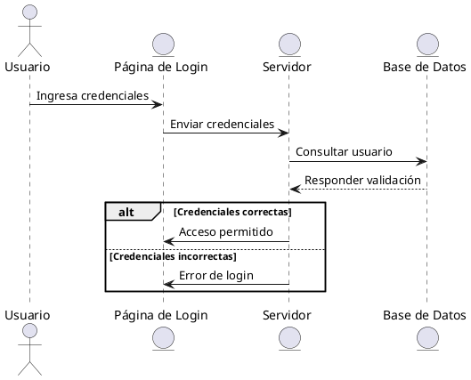

Los codigos se ejecutan en [PlantUML](https://www.plantuml.com/)

## Ejercicio 1

### Diagrama de Clases
Un restaurante necesita un sistema para gestionar sus pedidos. Se deben modelar las siguientes clases:
- **Cliente**
- **Pedido**
- **Producto**
- **Restaurante**

### Instrucciones:
1. Dibuja un Diagrama de Clases UML con estas entidades.
2. Agrega los atributos y métodos adecuados en cada clase.
3. Establece las relaciones correctas entre ellas (Asociación, Agregación, Composición, etc.).

### Resolución

### Imagen del Diagrama

---

## Ejercicio 2

### Diagrama de Casos de Uso
Modela los casos de uso para un sistema de biblioteca. Los actores principales son:
- **Usuario**
- **Bibliotecario**

### Instrucciones:
1. Dibuja un Diagrama de Casos de Uso UML.
2. Representa los siguientes casos de uso:
   - Buscar libro
   - Pedir préstamo
   - Devolver libro
   - Administrar inventario
3. Usa Asociación, Inclusión (<<include>>) y Extensión (<<extend>>) cuando sea necesario.

### Resolución

### Imagen del Diagrama

---

## Ejercicio 3

### Diagrama de Secuencia
Modela el flujo de inicio de sesión en un sistema web. Los elementos involucrados son:
- **Usuario**
- **Página de Login**
- **Servidor**
- **Base de Datos**

### Instrucciones:
1. El Usuario ingresa sus credenciales en la Página de Login.
2. La Página de Login envía los datos al Servidor.
3. El Servidor consulta la Base de Datos para validar el usuario.
4. La Base de Datos responde al Servidor.
5. Si los datos son correctos, el Servidor permite el acceso; de lo contrario, muestra un error.
6. Usa los tipos de mensajes adecuados (->, -->, -->>).

### Resolución

### Imagen del Diagrama

---

[Clase2.pdf](https://github.com/user-attachments/files/19510744/Clase2.pdf)

# Caso Práctico: Sistema de Gestión de Bodega de Insumos Médicos

## Contexto
Una empresa de distribución de insumos médicos cuenta con una bodega central y dos sucursales. La bodega es responsable de recibir productos de distintos proveedores, almacenarlos y distribuirlos a las sucursales según su demanda.

Cada sucursal puede solicitar productos a la bodega central cuando su stock está bajo, y la bodega debe gestionar los envíos. Además, la empresa necesita un control detallado del inventario en cada ubicación y registrar las ventas de las sucursales.

## Problemática
Actualmente, la empresa no cuenta con un sistema automatizado para la gestión de inventarios y pedidos. Esto genera problemas como:
- Falta de control sobre el stock en la bodega y sucursales.
- Retrasos en la reposición de productos en las sucursales.
- Errores en la distribución de insumos médicos.
- Poca visibilidad sobre las ventas y movimientos de productos.

## Lo que hay que hacer
Se requiere diseñar un sistema de gestión de la bodega y las sucursales, modelando los siguientes diagramas UML:

### Diagrama de Clases:
- Definir clases como `BodegaCentral`, `Sucursal`, `Producto`, `Pedido`, `Proveedor`, `Venta`.
- Establecer relaciones entre ellas (asociaciones, agregaciones o composiciones).

### Diagrama de Casos de Uso:
- Identificar los actores principales: `Administrador de Bodega`, `Jefe de Sucursal`.
- Modelar los casos de uso como `Solicitar insumos`, `Registrar ingreso de productos`, `Registrar venta`, `Actualizar stock`.

### Diagrama de Secuencia:
- Representar el flujo de una solicitud de reposición de una sucursal a la bodega central, incluyendo validaciones de stock y confirmación del pedido.

---

# Rúbrica de Evaluación: Sistema de Gestión de Bodega de Insumos Médicos

## Criterios de Evaluación:

| Criterio               | Excelente (10-9)                                      | Bueno (8-7)                                         | Aceptable (6-5)                                    | Deficiente (<5)                                      | Puntaje |
|------------------------|------------------------------------------------|-------------------------------------------------|-------------------------------------------------|-------------------------------------------------|---------|
| **Diagrama de Clases** | Define correctamente todas las clases principales, sus atributos y métodos. Establece relaciones precisas (asociaciones, agregaciones o composiciones). Uso adecuado de notación UML. | Define la mayoría de las clases requeridas con relaciones adecuadas, pero con algunos errores menores en la notación o relaciones. | Presenta las clases principales, pero con relaciones incorrectas o atributos/métodos insuficientes. | No presenta el diagrama de clases o es incorrecto en su totalidad. |         |
| **Diagrama de Casos de Uso** | Identifica todos los actores y casos de uso correctamente. Relaciona de forma precisa los casos de uso con los actores. Uso adecuado de estereotipos y notación UML. | Identifica la mayoría de los actores y casos de uso. Las relaciones son claras, aunque con algunos errores menores. | Presenta los actores y casos de uso básicos, pero con errores en las relaciones o falta de claridad en algunos casos de uso. | No presenta el diagrama de casos de uso o contiene errores graves en la identificación de actores y casos de uso. |         |
| **Diagrama de Secuencia** | Representa claramente el flujo de solicitud de reposición con mensajes bien secuenciados. Uso correcto de objetos, activaciones y retornos de mensajes. | Representa el flujo de solicitud con algunos errores en la secuencia o notación UML. | Presenta el flujo de reposición, pero con errores importantes en la secuencia o en el uso de elementos UML. | No presenta el diagrama de secuencia o es ilegible/incorrecto. |         |
| **Claridad y Organización** | La documentación y diagramas están bien estructurados, explicados y son fáciles de entender. | Presenta una organización adecuada, aunque algunas partes pueden ser confusas o desordenadas. | Tiene problemas de organización y claridad en la documentación y los diagramas. | Información desordenada, confusa o difícil de interpretar. |         |
| **Justificación del Modelo** | Explica detalladamente el diseño del sistema y la lógica de las relaciones entre clases, casos de uso y secuencias. | Explica de manera general la lógica del sistema, aunque con algunas imprecisiones. | Justificación superficial, con escasa relación entre los diagramas. | No proporciona una justificación del modelo o es incoherente. |         |
| **Uso Correcto de UML** | Uso riguroso de la notación UML en todos los diagramas. | Uso adecuado de UML con algunos errores menores. | Uso limitado o incorrecto de UML en varios diagramas. | No respeta la notación UML o es inadecuada. |         |
| **Entrega a Tiempo** | Entrega dentro del plazo establecido. | Entrega con leve retraso (1-2 días). | Entrega con retraso considerable (3-5 días). | No entrega el trabajo o lo entrega con más de 5 días de retraso. |         |

## Total: /70

