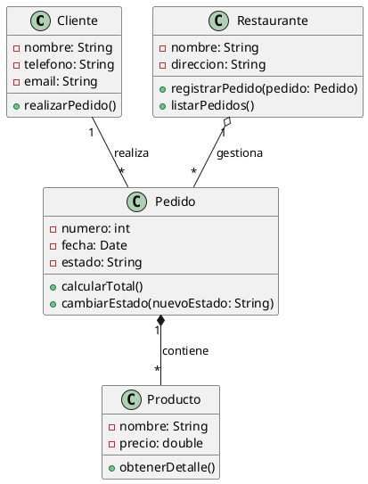
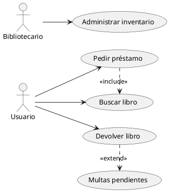
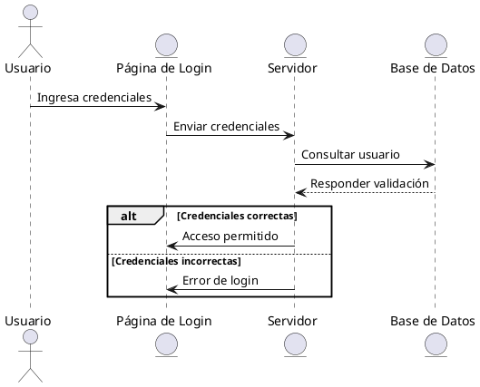

Los codigos se ejecutan en [PlantUML](https://www.plantuml.com/)

## Ejercicio 1

### Diagrama de Clases
Un restaurante necesita un sistema para gestionar sus pedidos. Se deben modelar las siguientes clases:
- **Cliente**
- **Pedido**
- **Producto**
- **Restaurante**

### Instrucciones:
1. Dibuja un Diagrama de Clases UML con estas entidades.
2. Agrega los atributos y métodos adecuados en cada clase.
3. Establece las relaciones correctas entre ellas (Asociación, Agregación, Composición, etc.).

### Resolución

### Imagen del Diagrama

---

## Ejercicio 2

### Diagrama de Casos de Uso
Modela los casos de uso para un sistema de biblioteca. Los actores principales son:
- **Usuario**
- **Bibliotecario**

### Instrucciones:
1. Dibuja un Diagrama de Casos de Uso UML.
2. Representa los siguientes casos de uso:
   - Buscar libro
   - Pedir préstamo
   - Devolver libro
   - Administrar inventario
3. Usa Asociación, Inclusión (<<include>>) y Extensión (<<extend>>) cuando sea necesario.

### Resolución

### Imagen del Diagrama

---

## Ejercicio 3

### Diagrama de Secuencia
Modela el flujo de inicio de sesión en un sistema web. Los elementos involucrados son:
- **Usuario**
- **Página de Login**
- **Servidor**
- **Base de Datos**

### Instrucciones:
1. El Usuario ingresa sus credenciales en la Página de Login.
2. La Página de Login envía los datos al Servidor.
3. El Servidor consulta la Base de Datos para validar el usuario.
4. La Base de Datos responde al Servidor.
5. Si los datos son correctos, el Servidor permite el acceso; de lo contrario, muestra un error.
6. Usa los tipos de mensajes adecuados (->, -->, -->>).

### Resolución

### Imagen del Diagrama

---

[Clase2.pdf](https://github.com/user-attachments/files/19510744/Clase2.pdf)

