# 🧠 Resumen de Clase: Patrones de Diseño - Adapter y Bridge

Este documento resume todo lo trabajado en clase respecto a los patrones de diseño **Adapter** y **Bridge**,incluye teoría, diagramas UML.

---

## 🧱 Introducción: Patrones Estructurales

Los patrones estructurales permiten organizar clases y objetos para formar estructuras más complejas y reutilizables. En esta clase abordamos:

- 🔌 **Adapter**: hace que clases incompatibles trabajen juntas.
- 🌉 **Bridge**: separa una abstracción de su implementación.

También recordamos brevemente patrones vistos previamente como **Singleton** y **Prototype**.

---

## 🔌 Adapter

### 📖 ¿Qué es?
Permite que una clase existente con una interfaz incompatible pueda ser utilizada como si implementara una interfaz deseada, **sin modificar su código original**.

### ⚙️ Estructura del patrón

- `Client` usa `Target`
- `Adapter` implementa `Target` y traduce hacia `Adaptee`
- `Adaptee` es la clase ya existente

### 🧩 Diagramas UML

**Clases (versión enchufe):**


**Caso de Uso (enchufe):**

```plantuml
@startuml
actor Usuario
rectangle "Sistema Eléctrico" {
    usecase "Conectar enchufe chileno"
}
rectangle "Dispositivo Europeo" {
    usecase "entregarCorriente()"
}
Usuario --> "Conectar enchufe chileno"
"Conectar enchufe chileno" --> "entregarCorriente()" : vía adaptador
@enduml
```



### 💻 Ejemplo Java simple (enchufe)
Clases: `Pared`, `Enchufe`, `EnchufeEuropeo`, `Adaptador`, `Demo`

```java
public class Pared {

    public void conectar(Enchufe enchufe) {
        System.out.println("Conectando a la pared... Chilena");
        enchufe.proveerElectricidad();
    }
}
```

```java
public interface Enchufe {
    public void proveerElectricidad();
}
```

```java
public class EnchufeEuropeo {
    public void entregarCorriente() {
        System.out.println("Entregando corriente de 220V");
    }
}
```

```java
public class Adaptador implements Enchufe {

    private EnchufeEuropeo europeo;

    public Adaptador(EnchufeEuropeo europeo) {
        this.europeo = europeo;
    }

    @Override
    public void proveerElectricidad() {
        europeo.entregarCorriente();
    }

}
```

```java
public class EnchufeDemo {
    public static void main(String[] args) {
        EnchufeEuropeo europeo = new EnchufeEuropeo();
        Enchufe adaptador = new Adaptador(europeo);
        Pared pared = new Pared();

        pared.conectar(adaptador);

    }
}

```

### 💻 Ejemplo Java real: API de mensajería
Sistema espera `IMensaje`. API externa usa `ServicioTelegram`. Creamos `MensajeAdapter implements IMensaje`.

```java
public interface IMensaje {
    void enviarMensaje();
}
```
```java
public class ServicioTelegram {

    public void enviarMensajeTelegram() {
        System.out.println("Mensaje enviado por Telegram");
    }
}

```

```java
public class SistemaMensajeria {

    public void enviar(IMensaje mensaje) {

        System.out.println("Sistema de mensajeria iniciado");
        mensaje.enviarMensaje();
    }
}

```

```java
public class MensajeAdapter implements IMensaje {

    private ServicioTelegram servicioTelegram;

    public MensajeAdapter(ServicioTelegram servicioTelegram) {
        this.servicioTelegram = servicioTelegram;
    }

    @Override
    public void enviarMensaje() {
        servicioTelegram.enviarMensajeTelegram();
    }
}

```
```java
public class MensajeriaDemo {
    public static void main(String[] args) {

        ServicioTelegram telegram = new ServicioTelegram();
        IMensaje mensaje = new MensajeAdapter(telegram);
        SistemaMensajeria sistema = new SistemaMensajeria();

        sistema.enviar(mensaje);
    }
}

```


---

## 🌉 Bridge

### 📖 ¿Qué es?
Permite separar una **abstracción** de su **implementación**, de modo que puedan modificarse y evolucionar de forma independiente.

### ⚙️ Estructura del patrón

- `Abstraction` usa un `Implementor`
- `RefinedAbstraction` amplía la abstracción
- `Implementor` define la interfaz de implementación
- `ConcreteImplementor` implementa la lógica

### 🔁 Diferencia con Adapter
- **Adapter** se usa cuando hay una clase existente que no se puede modificar.
- **Bridge** se usa cuando se quiere diseñar algo flexible desde el principio.

  


### 🧩 Diagramas UML

**Clases (control remoto):**


**Caso de Uso (control remoto):**

```plantuml
@startuml
actor Usuario
rectangle "Control Remoto" {
    usecase "Presionar botón de encendido"
}
rectangle "Dispositivo (TV o Radio)" {
    usecase "Encender dispositivo"
}
Usuario --> "Presionar botón de encendido"
"Presionar botón de encendido" --> "Encender dispositivo" : delega
@enduml
```



### 💻 Ejemplo Java simple
Clases: `Dispositivo`, `Televisor`, `Radio`, `ControlRemoto`, `ControlBasico`, `Demo`

```java
public interface Dispositivo {
    void encender();

    void apagar();
}

```

```java
public class Televisor implements Dispositivo {
    public void encender() {
        System.out.println("Televisor encendido.");
    }

    public void apagar() {
        System.out.println("Televisor apagado.");
    }
}

```

```java
public class Radio implements Dispositivo {
    public void encender() {
        System.out.println("Radio encendida.");
    }

    public void apagar() {
        System.out.println("Radio apagada.");
    }
}

```

```java
public abstract class ControlRemoto {
    protected Dispositivo dispositivo;

    public ControlRemoto(Dispositivo dispositivo) {
        this.dispositivo = dispositivo;
    }

    public abstract void presionarEncendido();
}

```

```java
public class ControlBasico extends ControlRemoto {

    public ControlBasico(Dispositivo dispositivo) {
        super(dispositivo);
    }

    public void presionarEncendido() {
        System.out.println("Presionando botón de encendido...");
        dispositivo.encender();
    }
}

```

```java
public class ControlRemotoDemo {
    public static void main(String[] args) {
        Dispositivo tv = new Televisor();
        ControlRemoto controlTV = new ControlBasico(tv);
        controlTV.presionarEncendido();

        System.out.println();

        Dispositivo radio = new Radio();
        ControlRemoto controlRadio = new ControlBasico(radio);
        controlRadio.presionarEncendido();
    }
}

```


---

## 🌍 Caso Real – Bridge

### Contexto
Sistema de notificaciones con distintas **clases de mensajes** (`NotificacionAlerta`, `NotificacionResumen`) y **canales** (`Correo`, `SMS`).

### Diagrama de Clases:


### Diagrama de Caso de Uso:

```plantuml
@startuml
actor Sistema
rectangle "Módulo de Notificaciones" {
    usecase "Enviar Alerta"
}
rectangle "Canal de Envío" {
    usecase "enviar(String mensaje)"
}
Sistema --> "Enviar Alerta"
"Enviar Alerta" --> "enviar(String mensaje)" : delega
@enduml
```



### 💻 Código Java real
Se implementa `CanalEnvio` con `Correo`, `SMS`; clases de notificación usan Bridge para enviar el mensaje.

```java
public interface CanalEnvio {
    void enviar(String mensaje);
}

````
```java
public class CorreoElectronico implements CanalEnvio {
    public void enviar(String mensaje) {
        System.out.println("📧 Enviando por correo: " + mensaje);
    }
}
````
```java
public class SMS implements CanalEnvio {
    public void enviar(String mensaje) {
        System.out.println("📱 Enviando por SMS: " + mensaje);
    }
}
````
```java
public abstract class Notificacion {
    protected CanalEnvio canal;

    public Notificacion(CanalEnvio canal) {
        this.canal = canal;
    }

    
    public abstract void enviarNotificacion(String mensaje);
}
````
```java
public class NotificacionAlerta extends Notificacion {

    public NotificacionAlerta(CanalEnvio canal) {
        super(canal);
    }

    @Override
    public void enviarNotificacion(String mensaje) {
        System.out.println("🔔 Preparando alerta...");
        canal.enviar("[ALERTA] " + mensaje);
    }
}

```
```java
public class NotificacionDemo {
    public static void main(String[] args) {
        // Enviar una alerta por correo
        CanalEnvio correo = new CorreoElectronico();
        Notificacion alertaCorreo = new NotificacionAlerta(correo);
        alertaCorreo.enviarNotificacion("Servidor caído");

        System.out.println();

        // Enviar una alerta por SMS
        CanalEnvio sms = new SMS();
        Notificacion alertaSMS = new NotificacionAlerta(sms);
        alertaSMS.enviarNotificacion("Temperatura crítica en el servidor");
    }
}

```
## 🧱 Presentación
[clase 7.pdf](https://github.com/user-attachments/files/20140020/clase.7.pdf)
